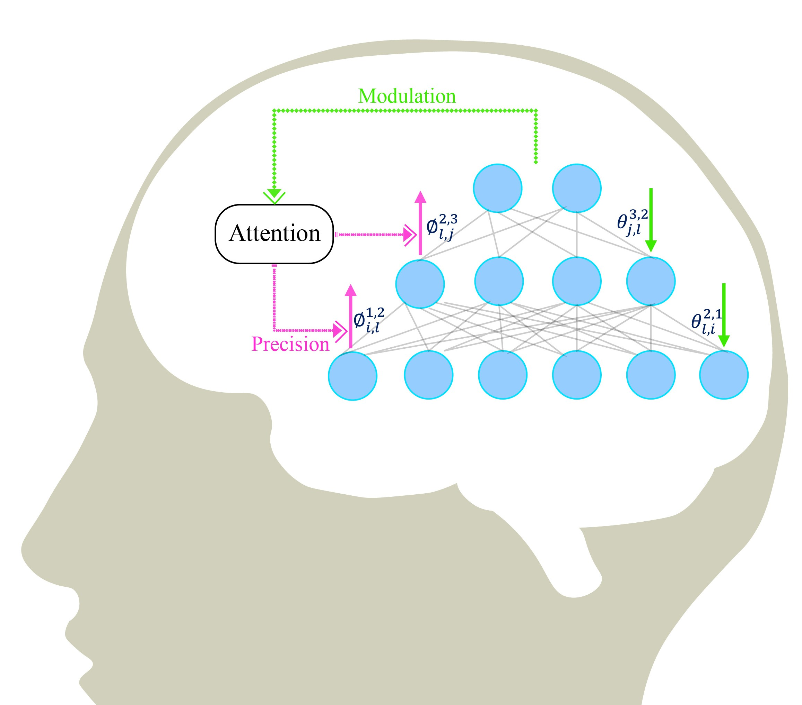

# Helmholtz-Neural-Machine-Predictive-Processing

This research aims to implement [predictive processing](https://royalsocietypublishing.org/rstb/article/370/1668/20140169/22572/Cerebral-hierarchies-predictive-processing), a core brain mechanism, using a neural network model, the Helmholtz machine, through its disentangled bottom-up and top-down processing pathways.

- Presented at Prof. Karl Friston’s Theoretical Neurobiology Seminar, University College London, February 17th, 2025 [[presentation slides](https://drive.google.com/file/d/1ox_62dwdvSlhftCa__Q_5jz91i9Y6tme/view)].
- The research idea is outlined in my publication [A New Theory of Data Processing: Applying Artificial Intelligence to Cognition and Humanity](https://dl.acm.org/doi/abs/10.1145/3577190.3616123), Proceedings of the 25th International Conference on Multimodal Interaction, 2023 [[Blue Sky Award Paper](https://drive.google.com/file/d/17B7YcH6yYmIA72H0vBXe0V1XoZg0GK5a/view)].
- This work is detailed in Chapter 3 of my [Ph.D. qualification writing](https://drive.google.com/file/d/1CNLO2FjDNW5RT0Zfc70ynZeVdm-KQsTH/view?pli=1), 2024, and included in my [Ph.D. dissertation](https://www.proquest.com/openview/581cd124d0c14930d566ba9010cecd67/1?pq-origsite=gscholar&cbl=18750&diss=y), 2025. Here is a [pre-print](https://drive.google.com/file/d/1RtnuLEfh247UQx3sRZRUlFQljYWC3aPN/view) of the first stage of this work.

<caption>
 Figure 1: Predictive Processing via the Helmholtz Machine. 
</caption>

## Research

- I devised a mechanism to implement predictive processing and Bayesian brain inference using the Helmholtz machine. Predictive processing performs a “Bayesian flip” upon the standard image of sensory processing that modulates bottom-up recognition by top-down predictions.
- The precision-weighted modulation of the recognition process also led the model to resist the long-standing problem in machine learning called **catastrophic forgetting**, which is demonstrated by a series of designed numerical experiments.
- The unique mode of attention-modulated learning by predictive processing paves the way for solving the problems in selective attention (e.g., the [cocktail party effect](https://en.wikipedia.org/wiki/Cocktail_party_effect)), [theory of expectation](https://direct.mit.edu/books/monograph/1961/Sweet-AnticipationMusic-and-the-Psychology-of), and [theory of mind](https://onlinelibrary.wiley.com/doi/abs/10.1111/sjp.12120).

<caption>
 Figure 1: Predictive Processing via the Helmholtz Machine. 
</caption>
